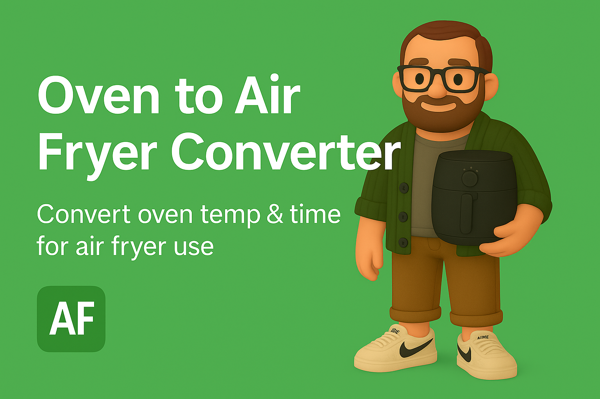

# Oven to Air Fryer Converter

---

A simple, responsive web app that converts conventional oven temperatures and times into air fryer equivalents. Supports both Celsius and Fahrenheit.

---

### 🔧 Features
- Convert oven temp/time to air fryer settings
- Input in Celsius or Fahrenheit
- Outputs both °C and °F air fryer equivalents
- Responsive design, mobile-friendly
- Favicon and preview image for social sharing
- SEO metadata and Twitter card integration

---

### 🌐 Live Demo
[**Try it now**](https://mattyhakin.github.io/over-to-airfryer/)

---

### 🧠 Conversion Rules
- Reduce oven temperature by ~25°F (~15°C)
- Reduce oven time by ~20%

---

### 📁 How to Use
1. Clone or download this repo.
2. Open `index.html` in your browser.
3. Or deploy to GitHub Pages for live access.

---

### 📝 License
This project is licensed under the [MIT License](LICENSE).

---

### 📷 Preview

